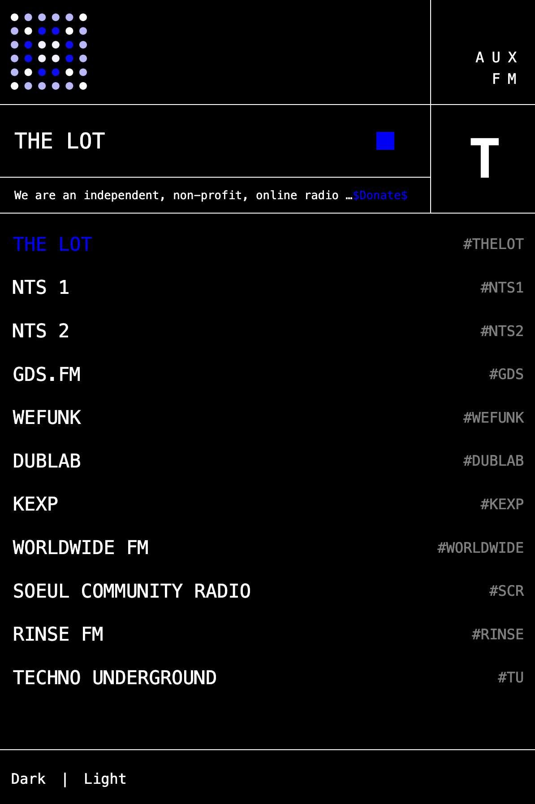

# AUX FM 

A utilitarian radio application <a href="fm.aux.eco">https://fm.aux.eco</a>




## Development

```bash
npm install
npm run dev
```

## Artefact not Product

This is an Artefact, not a product. This is not for profit or to collect any data. There is and there won't be any tracking, cookies, analytics or ads introduced on the main branch.

## Contribution

Please open PRs to add stations, fix bugs, or improve the app. The core idea is to have a set of curated stations that are useful for the community, so if you want to add your personal sations I encourage you to fork the repo and make your own version!


